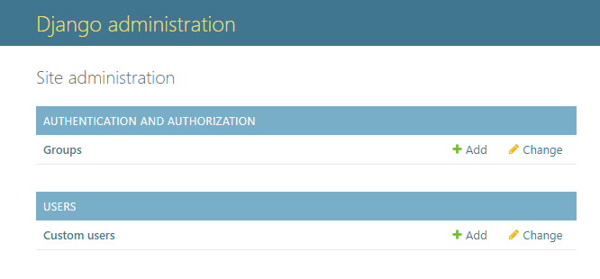
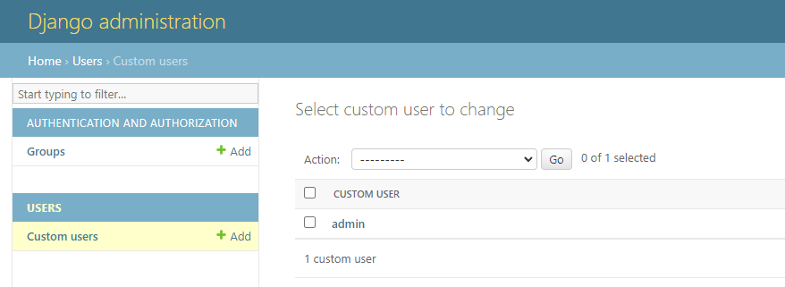
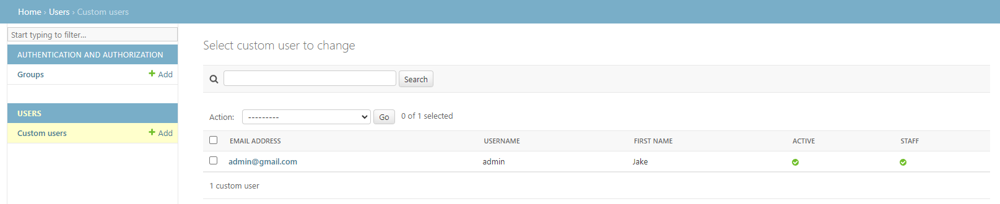
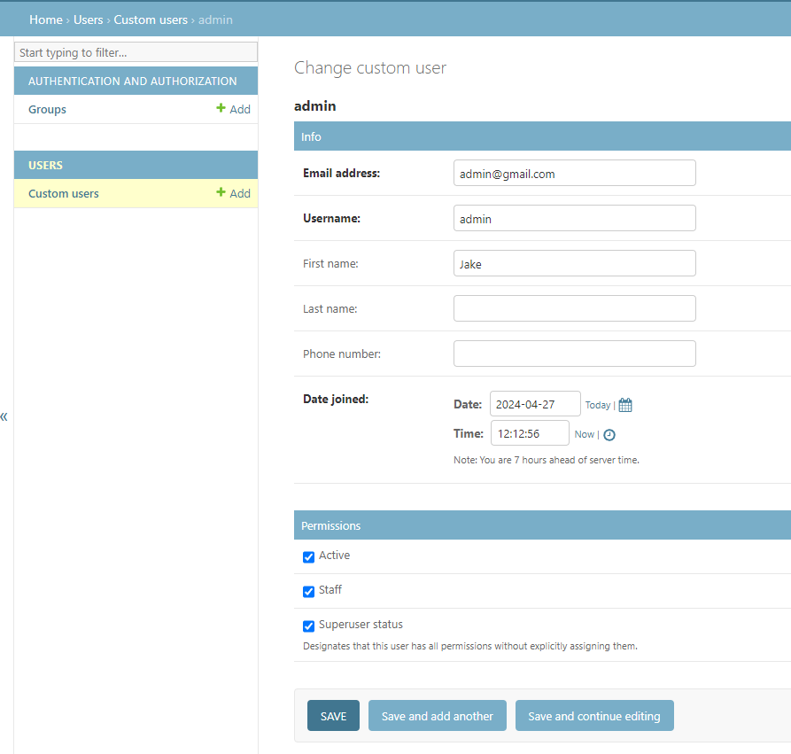
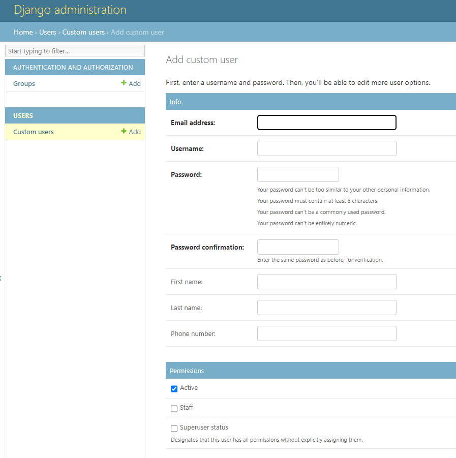
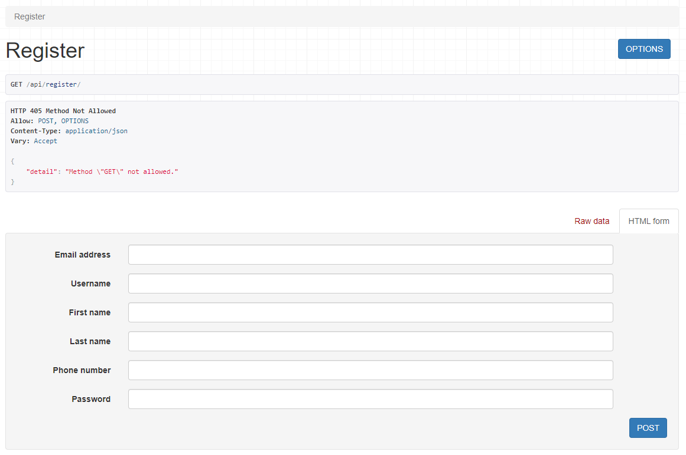
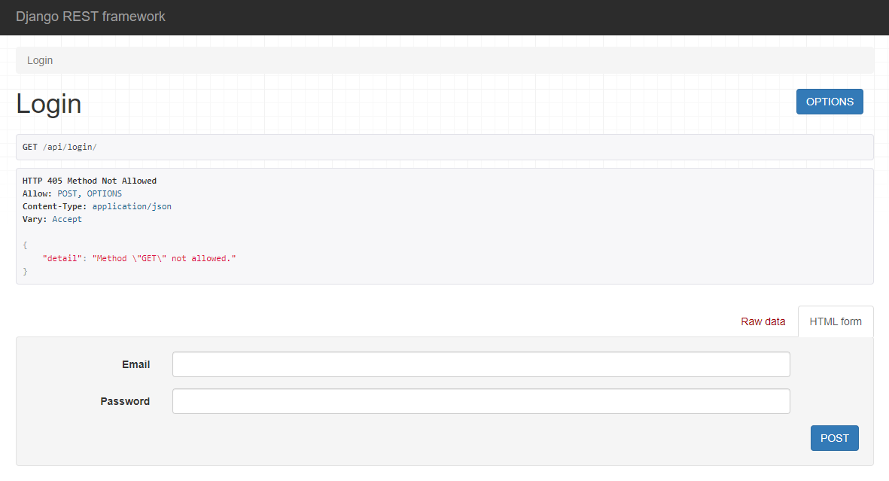
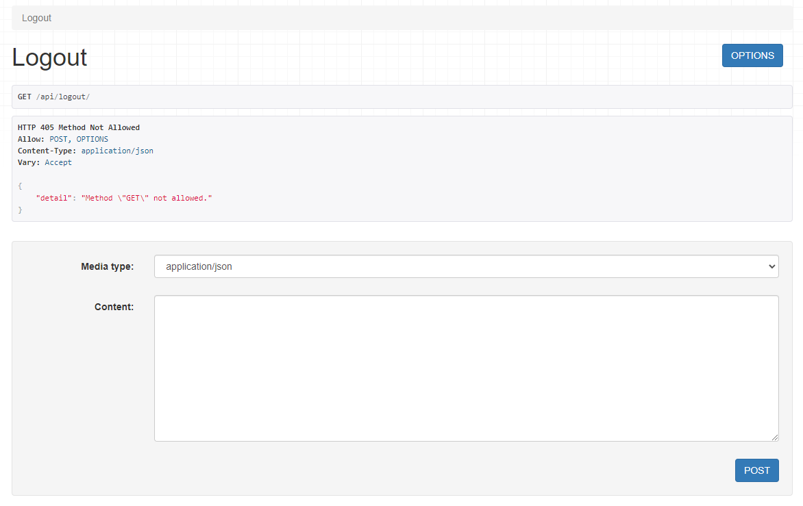

# Multi-bank-analytics project

### Setup project
1. Install django
    ```bash
    python -m pip install django
    ```
2. Create new Django project

    ```bash
    django-admin startproject backend
    ```
    ```bash
    cd backend
    ```
- You will have the following folder structure:

    ```
    ├── backend
    │   ├── __init__.py
    │   ├── asgi.py
    │   ├── urls.py
    │   ├── settings.py
    │   └── wsgi.py
    └── manage.py
    ```
3. Setup settings folder for different working environments (dev, staging, production, etc.)
- Create a `settings` folder in the root folder, including `__init__.py`, `base.py`, `dev.py`, and `prod.py` files. Also, you need to add `.env.dev` and `.env.prod` files in `env` folder to contain different variable values for specific working environments. Therefore, you will have to install `python-dotenv` to load variables from `.env` file:
    - `backend` folder is renamed to `core`.
    - `settings.py` file is moved into `settings` folder and renamed to `base.py`, then `ROOT_URLCONF` is changed to `core.urls`, and `WSGI_APPLICATION` is also changed to `core.wsgi.application`.
    - `ALLOWED_HOSTS` in `.env` files is a list of strings representing the host/domain names that your Django application can serve. This is a security measure to prevent HTTP Host header attacks. For dev, I will let it include `127.0.0.1` (localhost) and `0.0.0.0` (all IPv4 addresses on the local machine). For production, it will depends on your domain/host to be deployed.
    ```
    ├── core
    │   ├── __init__.py
    │   ├── asgi.py
    │   ├── urls.py
    │   ├── wsgi.py
    │   └── settings
    │       ├── __init__.py
    │       ├── base.py
    │       ├── dev.py
    │       └── prod.py
    ├── env
    │   ├── .env.dev
    │   └── .env.prod
    └── manage.py
    ```
    ```bash
    python -m pip install python-dotenv
    ```
    ```python
    # core/settings/base.py

    ROOT_URLCONF = 'core.urls'

    WSGI_APPLICATION = 'core.wsgi.application'
    ```
    ```python
    # core/settings/dev.py

    from .base import *
    import os
    from dotenv import load_dotenv

    DEBUG = True

    load_dotenv('env/.env.dev')

    SECRET_KEY = os.getenv('SECRET_KEY')

    ALLOWED_HOSTS = os.getenv('ALLOWED_HOST').split(',')
    ```
    ```python
    # core/settings/prod.py

    from .base import *
    import os
    from dotenv import load_dotenv

    DEBUG = False

    load_dotenv('env/.env.prod')

    SECRET_KEY = os.getenv('SECRET_KEY')

    ALLOWED_HOSTS = os.getenv('ALLOWED_HOST').split(',')
    ```
    ```bash
    # env/.env.*

    SECRET_KEY=<SECRET_KEY>
    ALLOWED_HOST=<HOST_1>,<HOST_2>,...
    ```
- You can generate new secret key just for production only using following command in terminal:
    ```bash
    python manage.py shell
    ```
    ```python
    >>> from django.core.management.utils import get_random_secret_key
    >>> print(get_random_secret_key())
    ```
- Configure `DJANGO_SETTINGS_MODULE` variable in `manage.py`, `asgi.py`, and `wsgi.py` files to let Django know which environment to run by default. We will set this to be `core.settings.dev`. When it comes to production, we will setup it in `docker-compose.yml` file to be `core.settings.prod`.

    ```python
    os.environ.setdefault('DJANGO_SETTINGS_MODULE', 'core.settings.dev')
    ```
    
4. Setup database using PostgreSQL
- Setup a PostgreSQL database in a remote server for production using Docker (in case if you don't have `sudo` permissions) by defining a `docker-compose.yml` file in your remote server:
    - The ports `5432:5432` option maps port 5432 inside the Docker container (right) to port 5432 on your host machine (left), allowing your Django application to connect to the PostgreSQL database.
    - `<VOLUME_NAME>:/var/lib/postgresql/data` part defines the path inside the Docker container where the volume will be mounted.
    - If `volumes: <VOLUME_NAME>:` is not configured, by default Docker will create a named volume and manage it using the `local` driver, which is at `/var/lib/docker/volumes/` on Linux host.
    - Start your PostgreSQL database with command `docker compose -f <docker-compose-file-for-database-path> up -d` and `docker compose -f <docker-compose-file-for-database-path> down` to stop or `docker compose -f <docker-compose-file-for-database-path> down -v` to stop the container and remove the volumes as well.
    - In this project, I will host 2 instances, one in the Linux remote server for production stage and the other in localhost in WSL for development stage. You can use `ip addr` to list out all networks interfaces to find the IP address of each instance as the `DATABASE_HOST`.
    ```yml
    services:
    db:
        image: postgres
        restart: always
        environment:
        POSTGRES_DB: <DATABASE_NAME>
        POSTGRES_USER: <USERNAME>
        POSTGRES_PASSWORD: <PASSWORD>
        ports:
        - 5432:5432
        volumes:
        - <VOLUME_NAME>:/var/lib/postgresql/data

    volumes:
        <VOLUME_NAME>:
    ```

- In case, you don't have a remote server, [Railway](https://railway.app/), [AWS RDS](https://aws.amazon.com/rds/free/), and [Render](https://docs.render.com/free) are 3rd-party host server for deploying a PostgreSQL database with free tier.
- Install `psycopg2` package, which is a PostgreSQL adapter for Python:
    ```bash
    python -m pip install psycopg2
    ```
- Add your DATABASES setting in your `dev.py` and `prod.py` files to use the PostgreSQL backend provided by Django:
    - `PORT`: by default is `5432`, but we will let it be `5433` for dev and `5432` for prod.
    ```python
    # core/settings/*.py

    DATABASES = {
        'default': {
            'ENGINE': 'django.db.backends.postgresql',
            'NAME': os.getenv('DATABASE_NAME'),
            'USER': os.getenv('USERNAME'),
            'PASSWORD': os.getenv('PASSWORD'),
            'HOST': os.getenv('DATABASE_HOST'),
            'PORT': os.getenv('DATABASE_PORT'),
        }
    }
    ```
- Add variables for `.env.*` files:
    ```bash
    DATABASE_NAME=<DATABASE_NAME>
    USERNAME=<DATABASE_USERNAME>
    PASSWORD=<DATABASE_PASSWORD>
    DATABASE_HOST=<DATABASE_HOST>
    DATABASE_PORT=<DATABASE_PORT>
    ```

- To interact with a PostgreSQL database using SQL queries in the terminal:
    ```bash
    sudo apt-get install postgresql-client
    ```
    ```bash
    psql -h <HOST> -U <USERNAME> -d <DATABASE_NAME> -p <PORT>
    ```
- After setting up everything, we will have a `backend` folder project like below:
    ```bash
    .
    ├── core
    │   ├── __init__.py
    │   ├── asgi.py
    │   ├── wsgi.py
    │   ├── urls.py
    │   └── settings
    │       ├── __init__.py
    │       ├── base.py
    │       ├── dev.py
    │       └── prod.py
    ├── docker
    │   ├── docker-compose-db.dev.yaml
    │   └── docker-compose-db.prod.yaml
    ├── env
    │   ├── .env.dev
    │   └── .env.prod
    └── manage.py
    ```

5. Migrate changes to create schema in the database

    ```bash
    python manage.py migrate
    ```
    
6. Run test server
    ```bash
    python manage.py runserver
    ```
- If everything is setup correctly, we will get the page like below:

    

### Development stage

1. **Install and setup basic dependencies and packages**:

    - Install `djangorestframework` and add it to `base.py` file for building APIs.

    ```bash
    python -m pip install djangorestframework
    ```
    ```python
    # core/settings/base.py

    INSTALLED_APPS = [
        'django.contrib.admin',
        'django.contrib.auth',
        'django.contrib.contenttypes',
        'django.contrib.sessions',
        'django.contrib.messages',
        'django.contrib.staticfiles',
        'rest_framework',  # Add this line
    ]
    ```

    - Install `django-cors-headers`, which is a Django application allowing a client (usually a web browser) to make a cross-domain request to your Django application. This is particularly useful when you're building a REST API that will be consumed by a client-side application running on a different domain.
    - You would need to set the `CORS_ALLOWED_ORIGINS` setting to a list of origins (client side) that are authorized to make cross-domain requests to your Django application. For dev, it wil usually be `http://localhost:8080` or `http://127.0.0.1:8080`.

    ```bash
    python -m pip install django-cors-headers
    ```
    ```python
    # core/settings/base.py

    INSTALLED_APPS = [
        ...
        'corsheaders',  # Add this line
        ...
    ]

    MIDDLEWARE = [
        ...
        'corsheaders.middleware.CorsMiddleware',  # Add this line
        ...
    ]
    ```
    ```python
    # core/settings/*.py
    
    CORS_ALLOWED_ORIGINS = os.getenv('CORS_ALLOWED_ORIGINS').split(',')
    ```
    ```bash
    # env/.env.*

    CORS_ALLOWED_ORIGINS=<HOST_1>,<HOST_2>,...
    ```

2. **Create app `users` for user management**:
    - Create `CustomUser` model in `models.py` utilizing `AbstractBaseUser` and `PermissionsMixin`. `AbstractBaseUser` provides the core implementation of a user model. You should also define a custom manager for your custom user model based on `BaseUserManager`. `gettext_lazy` function marks a string as being a translatable string, meaning it can be translated into different languages.
        - For `AbstractBaseUser`, you need to configure `USERNAME_FIELD` and `REQUIRED_FIELDS` attributes. `USERNAME_FIELD` is a string describing the name of the field on the user model that is used as the unique identifier and `REQUIRED_FIELDS` is a list of the field names that will be prompted for when creating a user via the `createsuperuser` management command, which must include any field for which blank is False or undefined and may include additional fields you want prompted for when a user is created interactively.
        - `BaseUserManager` is used only when your user model defines fields different from `username`, `email`, `is_staff`, `is_active`, `is_superuser`, `last_login`, and `date_joined`. Creating this model includes defining `create_user` and `create_superuser` functions also. `BaseUserManager.normalize_email()` function will normalize email addresses by lowercasing the domain portion of the email address.
    - You will need to register `CustomUser` model with Django's admin site in `admin.py` file to be able to see it in the admin interface.
    - Next, update your `AUTH_USER_MODEL` setting and add `users` to `INSTALLED_APPS` in `base.py` file to tell Django to use your custom user model for authentication.
    - Run `python manage.py makemigrations` then `python manage.py migrate` to create schema for app `users` in the database.
    - Run `python manage.py createsuperuser` to create an admin account.
    - Run `python manage.py runserver` and access to `http://127.0.0.1:8000/admin/` with the admin account you just created.

    ```bash
    python manage.py startapp users
    ```
    ```bash
    users
    ├── __init__.py
    ├── migrations
    │   └── __init__.py
    ├── admin.py
    ├── apps.py
    ├── models.py
    ├── tests.py
    └── views.py
    ```
    ```python
    # users/models.py

    from django.db import models
    from django.utils import timezone
    from django.utils.translation import gettext_lazy as _
    from django.contrib.auth.models import AbstractBaseUser, PermissionsMixin, BaseUserManager

    class CustomUserManager(BaseUserManager):
        def create_user(self, email, username, first_name, password, **other_fields):
            """Creates and saves a User with the given email, username, first name and password."""
            if not email:
                raise ValueError(_('The email field must be set.'))
            if not password:
                raise ValueError(_('The password field must be set.'))
            
            email = self.normalize_email(email)
            user = self.model(
                email=self.normalize_email(email),
                username=username,
                first_name=first_name,
                **other_fields
            )
            user.set_password(password)
            user.save(using=self._db)

            return user

        def create_superuser(self, email, username, first_name, password, **other_fields):
            """Creates and saves a superuser with the given email, username, first name and password."""

            other_fields.setdefault('is_staff', True)
            other_fields.setdefault('is_superuser', True)
            other_fields.setdefault('is_active', True)

            return self.create_user(email, username, first_name, password, **other_fields)
        
    class CustomUser(AbstractBaseUser, PermissionsMixin):
        email = models.EmailField(_('email address'), unique=True)
        username = models.CharField(max_length=150, unique=True)
        first_name = models.CharField(max_length=150, blank=True)
        last_name = models.CharField(max_length=150, blank=True)
        phone_number = models.CharField(max_length=15, blank=True)
        date_joined = models.DateTimeField(_('date joined'), default=timezone.now)
        is_active = models.BooleanField(_('active'), default=True)
        is_staff = models.BooleanField(_('staff'), default=False)

        objects = CustomUserManager()

        USERNAME_FIELD = 'email'
        REQUIRED_FIELDS = ['username', 'first_name']

        def __str__(self):
            return self.username
    ```
    ```python
    # core/settings/base.py

    INSTALLED_APPS = [
        ...
        'users',  # Add this line
        ...
    ]

    AUTH_USER_MODEL = 'users.CustomUser' # Add this line
    ```
    ```python
    # users/admin.py

    from django.contrib import admin
    from .models import CustomUser

    admin.site.register(CustomUser)
    ```

    

    

3. **Configure admin interface for `CustomUser`**:
    ```python
    # users/admin.py

    from django.contrib import admin
    from django.contrib.auth.admin import UserAdmin
    from .models import CustomUser

    class CustomUserAdmin(UserAdmin):
        model = CustomUser

        search_fields = ['email', 'username', 'first_name']
        ordering = ['date_joined']
        list_display = ['email', 'username', 'first_name', 'is_active', 'is_staff']

        fieldsets = [
            ['Info', {'fields': ['email', 'username', 'first_name', 'last_name', 'phone_number', 'date_joined']}],
            ['Permissions', {'fields': ['is_active', 'is_staff', 'is_superuser']}]
        ]

        add_fieldsets = [
            ['Info', {'fields': ['email', 'username', 'password1', 'password2', 'first_name', 'last_name', 'phone_number']}],
            ['Permissions', {'fields': ['is_active', 'is_staff', 'is_superuser']}]
        ]

    admin.site.register(CustomUser, CustomUserAdmin)
    ```
    <br>
    
    <br>
    <br>
    
    <br>
    <br>
    
    <br>
    <br>

4. **Write Authentication APIs for user: register, login, logout, and authentication/authorization**:
    - Create `CustomUserSerializer` and `LoginSerializer` serializers in `serializers.py` in `users` app. These serializers are used to convert complex data types to Python native datatypes that can be easily rendered into JSON or XML to send response from the API, or when you need to validate incoming data against certain rules or constraints for creating or updating model instances to ensure that the received data is in the correct format and meets the expectations before being used in the application.
        - In `CustomUserSerializer`, we're using `ModelSerializer` which will automatically create fields based on the `User` model. We're including the password field in `extra_kwargs` with `'write_only': True` to ensure that the password can't be read. The `create` method is overridden to ensure that the password is hashed before it is stored in the database. The `set_password` method handles the hashing.
        - In `LoginSerializer`, we're using `EmailField` for the email to ensure that the email is valid. The `validate` method is overridden to authenticate the user with the provided email and password. If the authentication is successful and the user is active, it returns the user. Otherwise, it raises a `ValidationError`.
    - Next, create `Register`, `Login`, and `Logout` class with corresponding methods for each API.
        - `APIView` is used when you want to **handle all the logic yourself**. It doesn't require you to define a serializer or a queryset, giving you full control over how the data is processed. For more details, you can read [here](https://www.django-rest-framework.org/api-guide/views/).
        - `generics.GenericAPIView` is a subclass of APIView that provides additional behaviors for handling common use cases. It's designed to be used with Django's ORM, and it requires you to define a queryset and/or a serializer_class. It is used when you want to leverage these built-in behaviors to reduce the amount of code you have to write. For more details, you can read [here](https://www.django-rest-framework.org/api-guide/generic-views/).
        - `ViewSet` is a higher-level abstraction that combines the logic for multiple related views into a single class. It's designed to handle common actions like list, create, retrieve, update, and delete. When you use a `ViewSet`, you typically define a queryset and a serializer_class, and then register the ViewSet with a router. This router automatically generates the appropriate URL patterns for the actions. It is used when you want to quickly set up a full set of **CRUD** operations without having to write individual views for each action. For more details, you can read [here](https://www.django-rest-framework.org/api-guide/viewsets/).
        - `permission_classes = [IsAuthenticated]` is used to ensure that the view can only be accessed by authenticated users. For convenience, we will set it **by default** to be IsAuthenticated, any view that does not need authentication will set `permission_classes = []`, so we don't need to add `permission_classes = [IsAuthenticated]` for every API since most of the APIs will require authentication. This can be done by configuring `DEFAULT_PERMISSION_CLASSES` setting. Furthermore, to make it easier to be modified based on production (`rest_framework.permissions.IsAuthenticated` by default) or development stage (`rest_framework.permissions.AllowAny` by default for testing), we can configure to load it from environment variable.
    - Add urls for your APIs in `urls.py` of `core`. To make it convenient, we'll add these urls in `users/urls.py` then include them in `core/urls.py`.
        - For function views, it is included as `views.<VIEW_NAME>`.
        - For class-based views, it is included as `<VIEW_NAME>.as_view()`.
    - Run `python manage.py runserver` and access to `http://127.0.0.1:8000/api/register/`, `http://127.0.0.1:8000/api/login/`, and `http://127.0.0.1:8000/api/logout/` to check if it works well (temporarily set the value of the variable `DEFAULT_PERMISSION_CLASSES` in .env.dev to `rest_framework.permissions.IsAuthenticated` to be able to see the effect of the authentication mechanism).

    ```python
    # users/serializers.py

    from django.contrib.auth import get_user_model, authenticate
    from rest_framework import serializers

    User = get_user_model()

    class CustomUserSerializer(serializers.ModelSerializer):
        class Meta:
            model = User
            fields = ('email', 'username', 'first_name', 'last_name', 'phone_number', 'password')
            extra_kwargs = {'password': {'write_only': True}}

        def create(self, validated_data):
            password = validated_data.pop('password')
            user = User(**validated_data)
            user.set_password(password)
            user.save()
            return user

    class LoginSerializer(serializers.Serializer):
        email = serializers.EmailField()
        password = serializers.CharField()

        def validate(self, data):
            user = authenticate(**data)
            if user and user.is_active:
                return user
            raise serializers.ValidationError("Email or Password is incorrect!")
    ```
    ```python
    # users/views.py

    from django.contrib.auth import login, logout

    from rest_framework import generics, status
    from rest_framework.views import APIView
    from rest_framework.response import Response
    from rest_framework.permissions import IsAuthenticated

    from .serializers import CustomUserSerializer, LoginSerializer

    class Register(generics.GenericAPIView):
        serializer_class = CustomUserSerializer

        def post(self, request):
            serializer = self.get_serializer(data=request.data)
            serializer.is_valid(raise_exception=True)
            user = serializer.save()
            return Response({"status": "Account is registered"}, status=status.HTTP_201_CREATED)

    class Login(generics.GenericAPIView):
        serializer_class = LoginSerializer

        def post(self, request):
            serializer = self.get_serializer(data=request.data)
            serializer.is_valid(raise_exception=True)
            user = serializer.validated_data
            login(request, user)
            return Response({"status": "Loged in succesfully"}, status=status.HTTP_200_OK)
            
    class Logout(APIView):

        def post(self, request):
            logout(request)
            return Response({"status": "Loged out succesfully"}, status=status.HTTP_200_OK)
    ```
    ```python
    # core/urls.py

    from django.contrib import admin
    from django.urls import path, include

    urlpatterns = [
        path('admin/', admin.site.urls),
        path('api/', include('users.urls')), # Add this line
    ]
    ```
    ```python
    # users/urls.py

    from django.urls import path
    from .views import *

    urlpatterns = [
        path('register/', Register.as_view(), name='register'),
        path('login/', Login.as_view(), name='login'),
        path('logout/', Logout.as_view(), name='logout'),
    ]
    ```
    <br>
    
    <br>
    <br>
    
    <br>
    <br>
    
    <br>
    <br>

5. **Use JWTs stored in HTTPOnly cookie for authentication/authorization**:
    - Install `djangorestframework_simplejwt` package.
    - Define `CustomAuthentication` class, which extends JWTAuthentication to overrides the `authenticate` method to get the JWT from the `HTTPOnly cookie` instead of the `Authorization` header. This also includes a `CSRF check`, which is a good security practice. With this custom authentication, the backend will automatically check for tokens in cookies and client sides don't have to include tokens with the requests manually. We will also need to configure this class for `DEFAULT_AUTHENTICATION_CLASSES` setting.
        - `JWT` (JSON Web Encryption) is often used for authentication and information exchange. When a user logs in, the server generates a JWT that encodes certain details about the user, such as their user ID or roles. This token is then sent back to the client, which stores it and includes it in every subsequent request to the server. The server can then verify the token to ensure the request is legitimate and determine the user's identity or permissions from the data encoded in the token.
        - `JWTs` are not recommended to store in `local storage` since it make them vulnerable to XSS attacks, which is that the tokens can be accessed by JavaScript. Therefore, JWTs are usually stored in `HTTPOnly cookies`:
            - **Protection against XSS attacks**: HTTPOnly cookies can't be accessed by JavaScript. This means that even if your site has a Cross-Site Scripting (XSS) vulnerability, an attacker can't use JavaScript to steal the JWT from the cookie.
            - **Automatic sending**: Cookies are automatically included with every HTTP request to the same domain. This means you don't need to manually add the JWT to the headers of every request.
            - **CSRF protection**: While storing JWTs in cookies does make your site vulnerable to CSRF attacks, this can be mitigated by using the `SameSite` attribute and CSRF tokens. The `SameSite` attribute can prevent the browser from sending cookies along with cross-site requests, and `CSRF tokens` can ensure that every state-changing request is only accepted from your own site.
        - `CSRF` (Cross-Site Request Forgery) is a type of attack that tricks the victim into submitting a malicious request. It uses the identity and privileges of the victim to perform an undesired function on their behalf. Particularly, when you use cookies for authentication, your application becomes vulnerable to CSRF attacks, since the cookies are **automatically included with every request**. An attacker can trick a user's browser into making a request to your application, and the user's cookies will be included with the request, authenticating it. To mitigate this, Django includes a CSRF middleware that adds a CSRF token to every outgoing request. This token is then checked with every incoming `POST` request. If the tokens don't match, Django rejects the request. JWT has three parts: a `header`, a `payload`, and a `signature`. The header typically contains metadata about the token and the algorithm used to sign it. The payload contains the actual data stored in the token. The signature is used to verify that the sender of the JWT is who it says it is and to ensure that the message wasn't changed along the way.
    - Define settings for JWT and HTTP Cookies with CSRF check:
        - `ACCESS_TOKEN_LIFETIME` defines how long the access token remains valid after it's issued. Access tokens are used to authenticate user requests. Once the access token expires, it can no longer be used for authentication.
        - `REFRESH_TOKEN_LIFETIME` defines how long the refresh token remains valid after it's issued. Refresh tokens are used to obtain new access tokens without requiring the user to re-authenticate. Once the refresh token expires, the user must authenticate again to get a new access and refresh token.
        - `ROTATE_REFRESH_TOKENS` if set to `True`, every time a refresh token is used to retrieve a new access token, a new refresh token will be created and the old one will be invalidated. This could potentially allow a user to stay authenticated indefinitely, as long as they keep using their refresh token to get a new access token before the refresh token itself expires. However, if the user doesn't make any requests for a period of time longer than the refresh token's lifetime (refresh token is automatically used to create new access token when making any request to the server with an expired access token), the refresh token will expire and they will need to log in again.
        - `BLACKLIST_AFTER_ROTATION` if set to `True`, after a refresh token is used to retrieve a new access token and a new refresh token is created (assuming `ROTATE_REFRESH_TOKENS` is `True`), the old refresh token will be added to a blacklist and will not be usable again.
        - `USER_ID_FIELD` is the name of the User model field that should be used to identify users. By default, this is set to `'id'`, which means that the user's ID is used to identify them.
        - `USER_ID_CLAIM` is the name of the claim in the JWT payload that should be used to identify the user. By default, this is set to `'user_id'`. When a JWT is created for a user, their user ID (as specified by `USER_ID_FIELD`) is included in the JWT payload under this claim. When a JWT is decoded, the user is identified by looking at this claim.
        - `CSRF_TRUSTED_ORIGINS` is a list of hosts which are trusted origins for CSRF checks. This should be set to the domain of your frontend application when you're making cross-origin POST requests.
        - `CORS_EXPOSE_HEADERS` is a list of headers that can be exposed to the browser's JavaScript during a CORS request. The `Content-Type` header is often used to specify the media type of the resource, while the `X-CSRFToken` header is used by Django to prevent Cross-Site Request Forgery attacks.
        - `CORS_ALLOW_CREDENTIALS` means that whether your site will accept cookies from requests made from different origins or not.
        - `AUTH_COOKIE_DOMAIN` specifies the domain that the cookies will be sent to and all its subdomains. When the backend server sends a `Set-Cookie` header in its response, the browser will store the cookie and include it in the HTTP header for **all future requests to the domain** specified in the `AUTH_COOKIE_DOMAIN` setting.
        - Settings with `COOKIE_HTTP_ONLY` determine whether your site's component cookie should be marked as `HTTPOnly`. An `HTTPOnly` cookie cannot be accessed by client-side scripts, which provides some protection against cross-site scripting (XSS) attacks.
        - Settings with `COOKIE_SECURE` mean that your cookies will only be sent over Https if `True` or sent over unencrypted Http if `False`. They should be set to `True` in a production environment. When the server is hosted with Http, client side will entercount `Cross-Origin-Opener-Policy` error, which means that the URL is not secure (without Https), then the CSRF token will not be included with the cookie making the CSRF check fail.
        - Settings with `COOKIE_SAMESITE` control the `SameSite` attribute of the CSRF cookie. The `SameSite` attribute determines whether the cookie should be sent along with cross-site requests.
            - `'Lax'`: The CSRF cookie is only sent in a cross-site request if the request is **a top-level navigation** that uses a safe Http method. This is the default value in modern browsers.
            - `'Strict'`: The CSRF cookie is not sent in any cross-site requests. This provides the highest level of isolation, but can also break sites where the user expects cross-site requests to carry state (like a logged-in session).
            - `'None'`: The CSRF cookie is sent in all requests, including cross-site requests. This value must be used together with the `COOKIE_SECURE` attribute set to True (i.e., the cookie must be sent over HTTPS).
        - Settings with `COOKIE_PATH` define the path for which the session cookie is valid, or more specifically the cookie will be sent on all requests that start with that path. This can be useful for improving the security of your application by limiting the scope of the cookie to only the parts of your application that need it.

    - Modify `Login`, `Logout` views to add JWTs stored in cookies and add `RefreshAcessToken` and `AuthStatus` views to create new access token when expired and check if access and refresh token is still valid and usable. Then add views to the `urls.py`.
        - `RefreshAcessToken` will inherit from `TokenRefreshView` class, which will **blacklist** the refresh token and rotate new refresh token when generating new access token.
    - Finally, run `python manage.py migrate` to apply changes and run server again to test if it works well.

    ```bash
    users
    ├── __init__.py
    ├── admin.py
    ├── apps.py
    ├── authenticate.py
    ├── migrations
    ├── models.py
    ├── serializers.py
    ├── tests.py
    ├── urls.py
    └── views.py
    ```

    ```bash
    python -m pip install djangorestframework_simplejwt
    ```
    ```python
    # users/authenticate.py

    from rest_framework_simplejwt.authentication import JWTAuthentication
    from django.conf import settings
    from rest_framework import authentication, exceptions

    def check_csrf(request):
        csrf_token = request.COOKIES.get('csrftoken')

        # Check if the CSRF token is missing
        if csrf_token is None:
            raise exceptions.PermissionDenied('CSRF Failed: CSRF token missing')

        # Set the CSRF token in the request's headers
        request.META['HTTP_X_CSRFTOKEN'] = csrf_token

        # Perform CSRF check
        check = authentication.CSRFCheck(request)
        reason = check.process_view(request, None, (), {})
        if reason:
            raise exceptions.PermissionDenied(f'CSRF check failed: {reason}')

    class CustomAuthentication(JWTAuthentication):
        def authenticate(self, request):
            raw_token = request.COOKIES.get(settings.SIMPLE_JWT['AUTH_COOKIE'], None)
            if raw_token is None:
                return None
            validated_token = self.get_validated_token(raw_token)

            if settings.SIMPLE_JWT['AUTH_COOKIE_SECURE']:
                check_csrf(request)

            return self.get_user(validated_token), validated_token  
    ```
    ```python
    # core/settings/base.py

    from datetime import timedelta

    INSTALLED_APPS = [
        ...
        'rest_framework_simplejwt.token_blacklist',     # Add this line to be able to blacklist old token
    ]

    SIMPLE_JWT = {
        'ACCESS_TOKEN_LIFETIME': timedelta(minutes=5),
        'REFRESH_TOKEN_LIFETIME': timedelta(days=1),
        'ROTATE_REFRESH_TOKENS': True,
        'BLACKLIST_AFTER_ROTATION': True,
        
        'ALGORITHM': 'HS256',                           # Encryption algorithm to be used
        'VERIFYING_KEY': None,                          # Not needed if same as `SIGNING_KEY`

        'AUTH_HEADER_TYPES': ('Bearer',),
        'USER_ID_FIELD': 'email',
        'USER_ID_CLAIM': 'user_id',
        'USER_AUTHENTICATION_RULE': 'rest_framework_simplejwt.authentication.default_user_authentication_rule',

        'AUTH_TOKEN_CLASSES': ('rest_framework_simplejwt.tokens.AccessToken',),
        'TOKEN_TYPE_CLAIM': 'token_type',
        'TOKEN_USER_CLASS': 'rest_framework_simplejwt.models.TokenUser',

        'AUTH_COOKIE': 'accessToken',                   # Cookie name for access token
        'AUTH_COOKIE_REFRESH': 'refreshToken',          # Cookie name for refresh token
        'AUTH_COOKIE_HTTP_ONLY': True,
        'AUTH_COOKIE_PATH': '/',
        'AUTH_COOKIE_SAMESITE': 'Lax',
    }

    # HTTP Cookie settings
    CORS_ALLOW_CREDENTIALS = True
    CORS_EXPOSE_HEADERS = ["Content-Type", "X-CSRFToken"]
    CSRF_COOKIE_HTTP_ONLY = True
    CSRF_COOKIE_SAMESITE = 'Lax'
    SESSION_COOKIE_SAMESITE = 'Lax'
    SESSION_COOKIE_PATH = '/'

    REST_FRAMEWORK = {
        'DEFAULT_AUTHENTICATION_CLASSES': (
            'users.authenticate.CustomAuthentication',
        )
    }
    ```
    ```python
    # core/utils.py

    def str2bool(s:str)->bool:
        if not s: return False
        return s.lower() == 'true'
    ```
    ```python
    # core/settings/*.py

    from core.utils import str2bool

    SIMPLE_JWT['SIGNING_KEY'] = os.getenv('SECRET_KEY')
    SIMPLE_JWT['AUTH_COOKIE_SECURE'] = str2bool(os.getenv('COOKIE_SECURE'))
    SIMPLE_JWT['AUTH_COOKIE_DOMAIN'] = os.getenv('AUTH_COOKIE_DOMAIN', default=None)

    SESSION_COOKIE_SECURE = str2bool(os.getenv('COOKIE_SECURE'))
    CSRF_COOKIE_SECURE = str2bool(os.getenv('COOKIE_SECURE'))
    
    CSRF_TRUSTED_ORIGINS = os.getenv('CSRF_TRUSTED_ORIGINS').split(',')

    REST_FRAMEWORK['DEFAULT_PERMISSION_CLASSES'] = [os.getenv('DEFAULT_PERMISSION_CLASSES')]
    ```
    ```bash
    # env/.env.dev

    COOKIE_SECURE=False
    CSRF_TRUSTED_ORIGINS=<HOST_1>,<HOST_2>,...

    DEFAULT_PERMISSION_CLASSES=rest_framework.permissions.AllowAny
    ```
    ```bash
    # env/.env.prod

    COOKIE_SECURE=True
    AUTH_COOKIE_DOMAIN=<HOST_DOMAIN>
    CSRF_TRUSTED_ORIGINS=<HOST_1>,<HOST_2>,...

    DEFAULT_PERMISSION_CLASSES=rest_framework.permissions.IsAuthenticated
    ```
    ```python
    # users/views.py

    from django.conf import settings
    from django.utils import timezone
    from django.middleware import csrf
    from django.http import QueryDict
    
    from rest_framework import generics, status, exceptions
    
    from rest_framework_simplejwt.tokens import RefreshToken
    from rest_framework_simplejwt.views import TokenRefreshView
    from rest_framework_simplejwt.token_blacklist.models import BlacklistedToken

    class Register(generics.GenericAPIView):
        serializer_class = CustomUserSerializer
        permission_classes = []

        # The rest of the view is the same as above

    class Login(generics.GenericAPIView):
        serializer_class = LoginSerializer
        permission_classes = []

        def post(self, request):
            serializer = self.get_serializer(data=request.data)
            serializer.is_valid(raise_exception=True)
            user = serializer.validated_data
            
            # Generate the refresh and access tokens
            refresh = RefreshToken.for_user(user)
            data = {
                "refreshToken": str(refresh),
                "accessToken": str(refresh.access_token)
            }
            
            # Set the access and refresh tokens for the Http cookie
            response = Response()
            response.set_cookie(
                key=settings.SIMPLE_JWT['AUTH_COOKIE'],
                value=data["accessToken"],
                expires=timezone.now() + settings.SIMPLE_JWT['ACCESS_TOKEN_LIFETIME'],
                secure=settings.SIMPLE_JWT['AUTH_COOKIE_SECURE'],
                httponly=settings.SIMPLE_JWT['AUTH_COOKIE_HTTP_ONLY'],
                samesite=settings.SIMPLE_JWT['AUTH_COOKIE_SAMESITE']
            )
            response.set_cookie(
                key=settings.SIMPLE_JWT['AUTH_COOKIE_REFRESH'],
                value=data["refreshToken"],
                expires=timezone.now() + settings.SIMPLE_JWT['REFRESH_TOKEN_LIFETIME'],
                secure=settings.SIMPLE_JWT['AUTH_COOKIE_SECURE'],
                httponly=settings.SIMPLE_JWT['AUTH_COOKIE_HTTP_ONLY'],
                samesite=settings.SIMPLE_JWT['AUTH_COOKIE_SAMESITE']
            )

            response["X-CSRFToken"] = csrf.get_token(request)

            data = {'message': 'Login successfully'}
            response.data = data

            return response
            
    class Logout(APIView):

        def post(self, request):
            try:
                # Get the refresh token from the request cookies
                refreshToken = request.COOKIES.get(settings.SIMPLE_JWT['AUTH_COOKIE_REFRESH'], None)

                # Blacklist the refresh token
                token = RefreshToken(refreshToken)
                token.blacklist()

                response = Response()
                # Delete the access and refresh token cookies
                response.delete_cookie(settings.SIMPLE_JWT['AUTH_COOKIE'])
                response.delete_cookie(settings.SIMPLE_JWT['AUTH_COOKIE_REFRESH'])
                # Delete the CSRF token cookies and CSRF token header
                response.delete_cookie("csrftoken")
                response["X-CSRFToken"]=None

                data = {'message': 'Logout successfully'}
                response.data = data
                
                return response
            except:
                raise exceptions.ParseError("Invalid token")
                
    class RefreshAcessToken(TokenRefreshView):
        permission_classes = []

        def post(self, request, *args, **kwargs):
            # Get the refresh token from the request cookies
            refreshToken = request.COOKIES.get(settings.SIMPLE_JWT['AUTH_COOKIE_REFRESH'], None)

            if refreshToken is not None:
                # Check if the request data is immutable to set it mutable to add the refresh token
                if isinstance(request.data, QueryDict):
                    request.data._mutable = True
                request.data['refresh'] = refreshToken
                request.data._mutable = False
            else:
                raise exceptions.ParseError("Refresh token is missing")

            # Call the parent class's post method to refresh the tokens
            response = super().post(request, *args, **kwargs)

            if response.status_code == 200:
                # Set the new access and refresh tokens in the response cookies
                response.set_cookie(
                    key=settings.SIMPLE_JWT['AUTH_COOKIE'],
                    value=response.data['access'],
                    expires=timezone.now() + settings.SIMPLE_JWT['ACCESS_TOKEN_LIFETIME'],
                    secure=settings.SIMPLE_JWT['AUTH_COOKIE_SECURE'],
                    httponly=settings.SIMPLE_JWT['AUTH_COOKIE_HTTP_ONLY'],
                    samesite=settings.SIMPLE_JWT['AUTH_COOKIE_SAMESITE']
                )
                response.set_cookie(
                    key=settings.SIMPLE_JWT['AUTH_COOKIE_REFRESH'],
                    value=response.data['refresh'],
                    expires=timezone.now() + settings.SIMPLE_JWT['REFRESH_TOKEN_LIFETIME'],
                    secure=settings.SIMPLE_JWT['AUTH_COOKIE_SECURE'],
                    httponly=settings.SIMPLE_JWT['AUTH_COOKIE_HTTP_ONLY'],
                    samesite=settings.SIMPLE_JWT['AUTH_COOKIE_SAMESITE']
                )
                response["X-CSRFToken"] = request.COOKIES.get("csrftoken")

                data = {'message': 'Refresh tokens successfully'}
                response.data = data

            return response

    class AuthStatus(APIView):

        def post(self, request):
            # Check if the refresh token exists in the request cookies
            refresh_token = request.COOKIES.get(settings.SIMPLE_JWT['AUTH_COOKIE_REFRESH'], None)

            # Create a RefreshToken object using the refresh token
            token = RefreshToken(refresh_token)

            # Check if the token is blacklisted
            if BlacklistedToken.objects.filter(token__jti=token['jti']).exists():
                raise exceptions.ParseError("Token is blacklisted")

            return Response({"status": "Authenticated"}, status=status.HTTP_200_OK)
    ```
    ```python
    # users/urls.py

    urlpatterns = [
        ...
        path('token/', RefreshAcessToken.as_view(), name='refresh-access-token'), # Add this line
        path('auth-status/', AuthStatus.as_view(), name='auth-status'), # Add this line
    ]
    ```
6. **Design database for the system**:

    We will design a system to manage customers of banks. Each user of the system (server) will be the representative as the bank manager account. The description details for the schema of the database as following:
    
    - Table `Bank` will have relationship M:N with table `Account` and table `Account` will have relationship N:1 with table `Customer`, which means that each bank will have many accounts, and each account will belong to a specific customer. Additionally, each customer can have accounts at different banks, enabling them to join multiple banks.
    - Table `Account` will have relationship 1:N with table `Loan` with partial participation constraint for `Account` side. This means that each account (customer) can have one or more loans with the bank, but it is also possible for an account to have no loans. However, each loan must be associated with a specific account.

        <br>
        
        <br>
        <br>
        
        <br>
        <br>

    - Now we need to start new app `bank` to create models for the above schema.
    - Based on the schema, we will have 4 models `Bank`, `Customer`, `Account`, and `Loan`. As mentioned above, one object `CustomUser` will be a representative of one object `Bank`, so we'll use attribute `manager` of model `Bank` to be foreign key referencing to model `CustomUser` to create relationship `1:1` between them.
    - For the `ID` attribute as the primary key of each model, we will use `uuid` for it due to its global uniqueness to avoid collisions.
    - The data to be loaded into the database, we will download from [Kaggle](https://www.kaggle.com/datasets/zaurbegiev/my-dataset?select=credit_train.csv). The value of the attributes of each model will be designed based on this dataset.
    - After applying migration of the models creation to the database, to check if the migration really works, we can use the command as following commands with some adjustment based on your database host `psql -h <HOST> -d <DATABASE_NAME> -U <USER_NAME> -p <PORT>` then `\dt`.
    - To upload data to the database, we will create a script `load_data.py` to process it and **a custom django-admin command** `loaddata` to run the script. 

        - For the script, we'll add decorate `@transaction.atomic` to the processing function to allow you to group a series of database operations into a single transaction. The main benefit of using it as a context manager is that it automatically commits the transaction if no exceptions occur. If an exception is raised during the context block, the transaction is rolled back, ensuring that the database remains in a consistent state. For the other attributes not in the dataset will be generated random value using library `Faker`.
        - To creat the custom command, add a `management/commands` directory to the application. Django will register a manage.py command for each Python module in that directory whose name doesn’t begin with an underscore.
    
    ```bash
    python manage.py startapp bank
    ```

    ```
    .
    ├── bank
    ├── core
    ├── docker
    ├── env
    ├── manage.py
    ├── requirements.txt
    └── users
    ```

    ```python
    # core/settings/base.py

    INSTALLED_APPS = [
        ...
        'users',
        'bank',
        ...
    ]
    ```

    ```python
    # bank/models.py

    from django.db import models
    from users.models import CustomUser
    import uuid

    class Bank(models.Model):
        """
        Model for bank information.
        """
        bank_id = models.UUIDField(primary_key=True, default=uuid.uuid4, editable=False)
        bank_name = models.CharField(max_length=255)
        manager = models.OneToOneField(CustomUser, on_delete=models.CASCADE)
        address = models.TextField(max_length=255, blank=True, null=True)
        city = models.CharField(max_length=255, blank=True, null=True)
        state = models.CharField(max_length=255, blank=True, null=True)
        zip_code = models.CharField(max_length=255, blank=True, null=True)
        country = models.CharField(max_length=255, blank=True, null=True)

        def __str__(self):
            return self.bank_name
        

    class Customer(models.Model):
        """
        Model for customer information.
        """

        YEARS_IN_JOB_CHOICES = [
            ('< 1 year', '< 1 year'),
            ('1 year', '1 year'),
            ('2 years', '2 years'),
            ('3 years', '3 years'),
            ('4 years', '4 years'),
            ('5 years', '5 years'),
            ('6 years', '6 years'),
            ('7 years', '7 years'),
            ('8 years', '8 years'),
            ('9 years', '9 years'),
            ('10+ years', '10+ years'),
        ]

        HOME_OWNERSHIP_CHOICES = [
            ('Rent', 'Rent'),
            ('Home Mortgage', 'Home Mortgage'),
            ('Own Home', 'Own Home'),
            ('Have Mortgage', 'Have Mortgage'),
            ('Other', 'Other'),
        ]

        customer_id = models.UUIDField(primary_key=True, default=uuid.uuid4, editable=False)
        first_name = models.CharField(max_length=128)
        last_name = models.CharField(max_length=128)
        phone = models.CharField(max_length=20, blank=True, null=True)
        address = models.TextField(max_length=255, blank=True, null=True)
        city = models.CharField(max_length=255, blank=True, null=True)
        state = models.CharField(max_length=128, blank=True, null=True)
        zip_code = models.CharField(max_length=10, blank=True, null=True)
        country = models.CharField(max_length=128, blank=True, null=True)
        credit_score = models.DecimalField(max_digits=20, decimal_places=2, blank=True, null=True)
        annual_income = models.IntegerField(blank=True, null=True)
        years_in_current_job = models.CharField(max_length=20, choices=YEARS_IN_JOB_CHOICES, blank=True, null=True)
        home_ownership = models.CharField(max_length=20, choices=HOME_OWNERSHIP_CHOICES, blank=True, null=True)
        years_of_credit_history = models.DecimalField(max_digits=5, decimal_places=2, blank=True, null=True)
        number_of_open_accounts = models.IntegerField(blank=True, null=True)
        number_of_credit_problems = models.IntegerField(blank=True, null=True)
        bankruptcies = models.IntegerField(blank=True, null=True)
        tax_liens = models.IntegerField(blank=True, null=True)

        def __str__(self):
            return self.first_name + ' ' + self.last_name


    class Account(models.Model):
        """
        Model for bank account information.
        """
        account_id = models.UUIDField(primary_key=True, default=uuid.uuid4, editable=False)
        bank = models.ForeignKey(Bank, on_delete=models.CASCADE)
        customer = models.ForeignKey(Customer, on_delete=models.CASCADE)
        account_number = models.CharField(max_length=255)
        balance = models.DecimalField(max_digits=20, decimal_places=2, blank=True, null=True)
        date_opened = models.DateField(auto_now_add=True)
        is_active = models.BooleanField(default=True)
        monthly_debt = models.DecimalField(max_digits=20, decimal_places=2, blank=True, null=True)
        current_credit_balance = models.DecimalField(max_digits=20, decimal_places=2, blank=True, null=True)
        maximum_open_credit = models.IntegerField(blank=True, null=True)
        months_since_last_delinquent = models.IntegerField(blank=True, null=True)

        def __str__(self):
            return self.account_number


    class Loan(models.Model):
        """
        Model for loan information.
        """

        TERM_CHOICES = [
            ('Short Term', 'Short Term'),
            ('Long Term', 'Long Term'),
        ]

        LOAN_STATUS_CHOICES = [
            ('Fully Paid', 'Fully Paid'),
            ('Charged Off', 'Charged Off'),
        ]

        loan_id = models.UUIDField(primary_key=True, default=uuid.uuid4, editable=False)
        account = models.ForeignKey(Account, on_delete=models.CASCADE)
        current_loan_amount = models.DecimalField(max_digits=20, decimal_places=2)
        term = models.CharField(max_length=20, choices=TERM_CHOICES)
        purpose = models.TextField(max_length=255)
        loan_status = models.CharField(max_length=20, choices=LOAN_STATUS_CHOICES)

        def __str__(self):
            return self.loan_id
    ```

    ```
    python manage.py makemigrations
    ```

    ```
    python manage.py migrate
    ```

    ```
    psql -h <HOST> -d <DATABASE_NAME> -U <USER_NAME> -p <PORT>
    ```
    
    ```
    <DATABASE_NAME>=#\dt
    ```

    ```
                            List of relations
    Schema |               Name                | Type  | Owner 
    --------+-----------------------------------+-------+-------
    public | auth_group                        | table | <DATABASE_NAME>
    public | auth_group_permissions            | table | <DATABASE_NAME>
    public | auth_permission                   | table | <DATABASE_NAME>
    public | bank_account                      | table | <DATABASE_NAME>
    public | bank_bank                         | table | <DATABASE_NAME>
    public | bank_customer                     | table | <DATABASE_NAME>
    public | bank_loan                         | table | <DATABASE_NAME>
    public | django_admin_log                  | table | <DATABASE_NAME>
    public | django_content_type               | table | <DATABASE_NAME>
    public | django_migrations                 | table | <DATABASE_NAME>
    public | django_session                    | table | <DATABASE_NAME>
    public | token_blacklist_blacklistedtoken  | table | <DATABASE_NAME>
    public | token_blacklist_outstandingtoken  | table | <DATABASE_NAME>
    public | users_customuser                  | table | <DATABASE_NAME>
    public | users_customuser_groups           | table | <DATABASE_NAME>
    public | users_customuser_user_permissions | table | <DATABASE_NAME>
    (16 rows)
    ```

    ```
    .
    ├── bank
    │   ├── __init__.py
    │   ├── admin.py
    │   ├── apps.py
    │   ├── load_data.py
    │   ├── management
    │   │   ├── __init__.py
    │   │   └── commands
    |   │        ├── __init__.py
    |   │        └── loaddata.py
    │   ├── migrations
    │   ├── models.py
    │   ├── tests.py
    │   └── views.py
    ├── core
    ├── data
    │   └── dataset.csv
    ├── docker
    ├── env
    ├── manage.py
    ├── requirements.txt
    └── users
    ```

    ```
    python -m pip install faker
    ```

    ```python
    # bank/load_data.py

    from django.db import transaction
    from .models import Bank, Customer, Account, Loan
    from users.models import CustomUser
    import csv
    import uuid
    from faker import Faker


    fake = Faker()

    @transaction.atomic
    def load_data_from_csv(file_path):
        manager = CustomUser.objects.create_user(username=fake.user_name(), first_name=fake.first_name(), email=fake.email(), password='password.123')
        bank = Bank.objects.create(bank_name=fake.company(), manager=manager, address=fake.address(), city=fake.city(), state=fake.state(), zip_code=fake.zipcode_in_state(), country=fake.country())

        with open(file_path, 'r') as file:
            reader = csv.DictReader(file)

            for row in reader:

                customer = Customer.objects.create(
                    # Baisc customer information
                    first_name=fake.first_name()[:128],
                    last_name=fake.last_name()[:128],
                    phone=fake.phone_number()[:20],
                    city=fake.city()[:255],
                    state=fake.state()[:128],
                    zip_code=fake.zipcode()[:10],
                    country=fake.country()[:128],

                    # Customer financial information
                    credit_score=row['Credit Score'] if row['Credit Score'] != '' else None,
                    annual_income=row['Annual Income'] if row['Annual Income'] != '' else None,
                    years_in_current_job=row['Years in current job'] if row['Years in current job'] != '' else None,
                    home_ownership=row['Home Ownership'] if row['Home Ownership'] != '' else None,
                    years_of_credit_history=row['Years of Credit History'] if row['Years of Credit History'] != '' else None,
                    number_of_open_accounts=row['Number of Open Accounts'] if row['Number of Open Accounts'] != '' else None,
                    number_of_credit_problems=row['Number of Credit Problems'] if row['Number of Credit Problems'] != '' else None,
                    bankruptcies=row['Bankruptcies'] if row['Bankruptcies'] != '' else None,
                    tax_liens=row['Tax Liens'] if row['Tax Liens'] != '' else None,
                )

                account = Account.objects.create(
                    bank=bank,
                    customer=customer,
                    account_number=str(uuid.uuid4()),
                    date_opened=fake.date_between(start_date='-30y', end_date='today'),
                    is_active=fake.boolean(chance_of_getting_true=50),
                    monthly_debt=row['Monthly Debt'] if row['Monthly Debt'] != '' else None,
                    current_credit_balance=row['Current Credit Balance'] if row['Current Credit Balance'] != '' else None,
                    maximum_open_credit=row['Maximum Open Credit'] if row['Maximum Open Credit'] != '' else None,
                    months_since_last_delinquent=row['Months since last delinquent'] if row['Months since last delinquent'] != '' else None,
                )

                Loan.objects.create(
                    account=account,
                    current_loan_amount=row['Current Loan Amount'] if row['Current Loan Amount'] != '' else None,
                    term=row['Term'] if row['Term'] != '' else None,
                    purpose=row['Purpose'] if row['Purpose'] != '' else None,
                    loan_status=row['Loan Status'] if row['Loan Status'] != '' else None,
                )
    ```

    ```python
    # bank/management/commands/loaddata.py

    from django.core.management.base import BaseCommand
    from bank.load_data import load_data_from_csv

    class Command(BaseCommand):
        help = 'Load data from CSV file to database'

        def add_arguments(self, parser):
            parser.add_argument('file_path', type=str, help='The path to the CSV file')

        def handle(self, *args, **kwargs):
            file_path = kwargs['file_path']
            load_data_from_csv(file_path)
    ```

    ```
    python manage.py loaddata data/dataset.csv
    ```

7. **Write APIs for the above database**:

    Now, after creating schema and load data to the database, we continue to write APIs for each model of the app `bank`, which will include these endpoints:

    - `api/register/bank/`: allow a user to register a new bank where they will be assigned as the manager.
    - `api/register/customer/`: allow a bank manager to register a new customer to their bank.
    - `api/register/account/`: allow a bank manager to register a new account for a customer of their bank.
    - `api/register/loan/`: allow a bank manager to register a new loan for a specific account in their bank.
    - `api/bank/`: allow an admin to retrieve a list of all registered banks. If a non-admin user accesses this endpoint, they will only see the bank(s) they manage.
    - `api/<model_name>/<uuid:pk>/`: allow the manager of the bank to retrieve, update, or delete a specific object it manages, except for bank model, both admin and manager of the bank can perform these operations on it. This means that the admin can only manage and monitor the banks but not their data.
    - `api/customer/`: allow a bank manager to retrieve a list of all customers in their bank.
    - `api/account/`: allow a bank manager to retrieve a list of all accounts in their bank.
    - `api/loan/`: allow a bank manager to retrieve a list of all loans in their bank.
    - `api/loan/?account=<account_id>/`: allow a bank manager to retrieve a list of all loans associated with a specific account in their bank.

    `Pagination` will be used in those GET endpoints to limit the number of results returned in a single response. This is useful when dealing with large amounts of data to improve the performance of the API and the user experience. The number of results per page can be adjusted in `PAGE_SIZE`. You need to set `DEFAULT_PAGINATION_CLASS` to `rest_framework.pagination.PageNumberPagination` to enable pagination style globally. You can read for more details in [here](https://www.django-rest-framework.org/api-guide/pagination/). 

    ```python
    # core/settings/base.py

    REST_FRAMEWORK = {
        'DEFAULT_AUTHENTICATION_CLASSES': (
            'users.authenticate.CustomAuthentication',
        ),
        'DEFAULT_PAGINATION_CLASS': 'rest_framework.pagination.PageNumberPagination',
        'PAGE_SIZE': 10,
    }
    ```

    ```python
    # bank/serializers.py

    from rest_framework import serializers

    from .models import *


    class BankSerializer(serializers.ModelSerializer):
        class Meta:
            model = Bank
            fields = '__all__'

    class CustomerSerializer(serializers.ModelSerializer):
        class Meta:
            model = Customer
            fields = '__all__'

    class AccountSerializer(serializers.ModelSerializer):
        class Meta:
            model = Account
            fields = '__all__'

    class LoanSerializer(serializers.ModelSerializer):
        class Meta:
            model = Loan
            fields = '__all__'
    ```
    
    ```python
    # bank/views.py

    from django.contrib.auth.models import AnonymousUser

    from rest_framework import status, generics, permissions
    from rest_framework.exceptions import PermissionDenied
    from rest_framework.response import Response

    from .serializers import *

    #=======================Registration APIs=======================

    class RegisterBank(generics.CreateAPIView):
        permission_classes = []
        serializer_class = BankSerializer

        def create(self, request, *args, **kwargs):
            response = super().create(request, *args, **kwargs)
            bank = response.data

            return Response({
                "message": f"Bank is registered",
                "id": bank['bank_id'],
                "bank name": bank['bank_name']
            }, status=status.HTTP_201_CREATED)
        
    class RegisterCustomer(generics.CreateAPIView):
        permission_classes = []
        serializer_class = CustomerSerializer

        def create(self, request, *args, **kwargs):
            response = super().create(request, *args, **kwargs)
            customer = response.data

            return Response({
                "message": f"Customer is registered",
                "id": customer['customer_id'],
                "customer name": f"{customer['first_name']} {customer['last_name']}"
            }, status=status.HTTP_201_CREATED)
        
    class RegisterAccount(generics.CreateAPIView):
        permission_classes = []
        serializer_class = AccountSerializer

        def create(self, request, *args, **kwargs):
            response = super().create(request, *args, **kwargs)
            account = response.data

            return Response({
                "message": f"Account is registered",
                "id": account['account_id'],
                "account number": account['account_number'],
                "bank": account['bank_id']
            }, status=status.HTTP_201_CREATED)

    class RegisterLoan(generics.CreateAPIView):
        permission_classes = []
        serializer_class = LoanSerializer

        def create(self, request, *args, **kwargs):
            response = super().create(request, *args, **kwargs)
            loan = response.data

            return Response({
                "message": f"Loan is registered",
                "id": loan['loan_id'],
                "loan amount": loan['loan_amount'],
                "account": loan['account_id'],
                "bank": loan['account']['bank_id']
            }, status=status.HTTP_201_CREATED)
        
    # =======================CRUD APIs=======================

    class IsAdminOrBankManager(permissions.BasePermission):
        """
        Custom permission to only allow admins or the manager of the bank to see it.
        """
        def has_object_permission(self, request, view, obj):
            # Permissions are only allowed to the owner of the snippet
            return request.user.is_staff or obj.manager == request.user

    class LC_Bank(generics.ListCreateAPIView):
        serializer_class = BankSerializer

        def get_queryset(self):
            user = self.request.user
            # Check if user is anonymous
            if isinstance(user, AnonymousUser):
                raise PermissionDenied("User is not authenticated")

            if user.is_staff:
                return Bank.objects.all()
            
            return Bank.objects.filter(manager=user)

    class RUD_Bank(generics.RetrieveUpdateDestroyAPIView):
        serializer_class = BankSerializer
        permission_classes = [IsAdminOrBankManager]

        def get_queryset(self):
            user = self.request.user
            # Check if user is anonymous
            if isinstance(user, AnonymousUser):
                raise PermissionDenied("User is not authenticated")

            if user.is_staff:
                return Bank.objects.all()

            return Bank.objects.filter(manager=user)


    class LC_Customer(generics.ListCreateAPIView):
        serializer_class = CustomerSerializer

        def get_queryset(self):
            user = self.request.user
            # Check if user is anonymous
            if isinstance(user, AnonymousUser):
                raise PermissionDenied("User is not authenticated")
            
            return Customer.objects.filter(account__bank__manager=user)

        def list(self, request, *args, **kwargs):
            queryset = self.filter_queryset(self.get_queryset())

            page = self.paginate_queryset(queryset)
            if page is not None:
                serializer = self.get_serializer(page, many=True)
                return self.get_paginated_response(serializer.data)
            
            # Handle the case where there is no pagination
            serializer = self.get_serializer(queryset, many=True)
            return Response(serializer.data)

    class RUD_Customer(generics.RetrieveUpdateDestroyAPIView):
        serializer_class = CustomerSerializer

        def get_queryset(self):
            user = self.request.user
            # Check if user is anonymous
            if isinstance(user, AnonymousUser):
                raise PermissionDenied("User is not authenticated")
            
            return Customer.objects.filter(account__bank__manager=user)


    class LC_Account(generics.ListCreateAPIView):
        serializer_class = AccountSerializer

        def get_queryset(self):
            user = self.request.user
            # Check if user is anonymous
            if isinstance(user, AnonymousUser):
                raise PermissionDenied("User is not authenticated")
            
            return Account.objects.filter(bank__manager=user)

        def list(self, request, *args, **kwargs):
            queryset = self.filter_queryset(self.get_queryset())

            page = self.paginate_queryset(queryset)
            if page is not None:
                serializer = self.get_serializer(page, many=True)
                return self.get_paginated_response(serializer.data)
            
            # Handle the case where there is no pagination
            serializer = self.get_serializer(queryset, many=True)
            return Response(serializer.data)

    class RUD_Account(generics.RetrieveUpdateDestroyAPIView):
        serializer_class = AccountSerializer

        def get_queryset(self):
            user = self.request.user
            return Account.objects.filter(bank__manager=user)


    class LC_Loan(generics.ListCreateAPIView):
        serializer_class = LoanSerializer

        def get_queryset(self):
            user = self.request.user
            # Check if user is anonymous
            if isinstance(user, AnonymousUser):
                raise PermissionDenied("User is not authenticated")
            
            account = self.request.query_params.get('account', None)

            if account is not None:
                return Loan.objects.filter(account__bank__manager=user, account=account)

            return Loan.objects.filter(account__bank__manager=user)

        def list(self, request, *args, **kwargs):
            queryset = self.filter_queryset(self.get_queryset())

            page = self.paginate_queryset(queryset)
            if page is not None:
                serializer = self.get_serializer(page, many=True)
                return self.get_paginated_response(serializer.data)
            
            # Handle the case where there is no pagination
            serializer = self.get_serializer(queryset, many=True)
            return Response(serializer.data)

    class RUD_Loan(generics.RetrieveUpdateDestroyAPIView):
        serializer_class = LoanSerializer

        def get_queryset(self):
            user = self.request.user
            # Check if user is anonymous
            if isinstance(user, AnonymousUser):
                raise PermissionDenied("User is not authenticated")
            
            return Loan.objects.filter(account__bank__manager=user)
    ```

    ```python
    # bank/urls.py

    from django.urls import path
    from .views import *


    urlpatterns = [
        # Register APIs
        path('regiser/bank/', RegisterBank.as_view(), name='register-bank'),
        path('register/customer/', RegisterCustomer.as_view(), name='register-customer'),
        path('register/account/', RegisterAccount.as_view(), name='register-account'),
        path('register/loan/', RegisterLoan.as_view(), name='register-loan'),

        # CRUD APIs
        path('bank/', LC_Bank.as_view(), name='List-Create-bank'),
        path('bank/<uuid:pk>/', RUD_Bank.as_view(), name='Retrieve-Update-Delete-bank'),

        path('customer/', LC_Customer.as_view(), name='List-Create-customer'),
        path('customer/<uuid:pk>/', RUD_Customer.as_view(), name='Retrieve-Update-Delete-customer'),

        path('account/', LC_Account.as_view(), name='List-Create-account'),
        path('account/<uuid:pk>/', RUD_Account.as_view(), name='Retrieve-Update-Delete-account'),

        path('loan/', LC_Loan.as_view(), name='List-Create-loan'),
        path('loan/<uuid:pk>/', RUD_Loan.as_view(), name='Retrieve-Update-Delete-loan'),
    ]
    ```

    ```python
    # core/urls.py

    urlpatterns = [
        path('admin/', admin.site.urls),
        path('api/', include('users.urls')),
        path('api/', include('bank.urls')), # Add this line
    ]
    ```

    ```
    bank
    ├── __init__.py
    ├── __pycache__
    ├── admin.py
    ├── apps.py
    ├── load_data.py
    ├── management
    ├── migrations
    ├── models.py
    ├── serializers.py
    ├── tests.py
    ├── urls.py
    └── views.py
    ```

8. **Write API to perform `Loan Status` prediction using ML model**:

    Next, we write an API to perform `Loan Status` prediction to help managers make decisions whether to approve or reject loan applications based on the predicted loan status.

    - We will train an ML model to perform prediction. We will perform model selection between `LightGBM` and `CatBoost` algorithms to choose the most suitable one. You can use Jupyter notebook `train_model.ipynb` to train model with your own choice of hyperparameters.
    - The model is loaded when the command `python manage.py runserver` is run and stays available for any prediction request.
    - For the serializer of the view, it will require the client to include values of the fields used during the training process.
    
    ```python
    # bank/serializers.py

    class PredictLoanStatusSerializer(serializers.ModelSerializer):
        class Meta:
            model = Loan
            fields = ['account', 'current_loan_amount', 'term', 'purpose']    
    ```

    ```python
    # bank/views.py

    with open('./models/best_model.pkl', 'rb') as f:
        model = pickle.load(f)

    class PredictLoanStatus(generics.GenericAPIView):
        serializer_class = PredictLoanStatusSerializer

        def post(self, request, *args, **kwargs):
            serializer = self.get_serializer(data=request.data)
            serializer.is_valid(raise_exception=True)
            account_id = serializer.validated_data['account'].account_id
            account = Account.objects.get(account_id=account_id)
            customer = account.customer

            # Prepare the data for prediction
            data = {
                'Current Loan Amount': serializer.validated_data['current_loan_amount'],
                'Term': serializer.validated_data['term'],
                'Credit Score': customer.credit_score,
                'Annual Income': customer.annual_income,
                'Years in current job': customer.years_in_current_job,
                'Home Ownership': customer.home_ownership,
                'Purpose': serializer.validated_data['purpose'],
                'Monthly Debt': account.monthly_debt,
                'Years of Credit History': customer.years_of_credit_history,
                'Months since last delinquent': account.months_since_last_delinquent,
                'Number of Open Accounts': customer.number_of_open_accounts,
                'Number of Credit Problems': customer.number_of_credit_problems,
                'Current Credit Balance': account.current_credit_balance,
                'Maximum Open Credit': account.maximum_open_credit,
                'Bankruptcies': customer.bankruptcies,
                'Tax Liens': customer.tax_liens
            }

            # Convert the data to data frame
            data = pd.DataFrame([data])

            # Make the prediction
            prediction = model.predict(data)
            if prediction[0] == 0:
                result = 'Charged Off'
            else:
                result = 'Fully Paid'

            return Response({'prediction': result}, status=status.HTTP_200_OK)
    ```

    ```python
    # bank/urls.py

    urlpatterns = [
        ...
        path('loan/predict/', PredictLoanStatus.as_view(), name='predict-loan-status'), # Add this line
    ]
    ```

    ```
    .
    ├── bank
    ├── core
    ├── data
    ├── docker
    ├── env
    ├── manage.py
    ├── models
    │   ├── best_model.pkl
    │   ├── catboost_info
    │   └── train_model.ipynb
    ├── requirements.txt
    └── users
    ```

### Production stage
